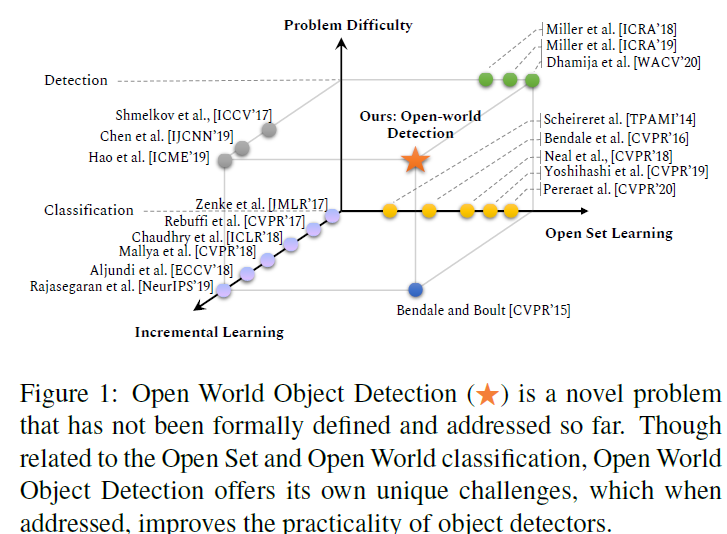

## Towards Open World Object Detection（CVPR 2021 Oral）
* 提出Open World Object Detection
* [code url](https://github.com/JosephKJ/OWOD)
* 提出的问题的相关领域即研究现状
  
  
* open world分类问题与检测问题有着本质上的不同，在目标检测中，位置的类在训练时会被识别成背景。