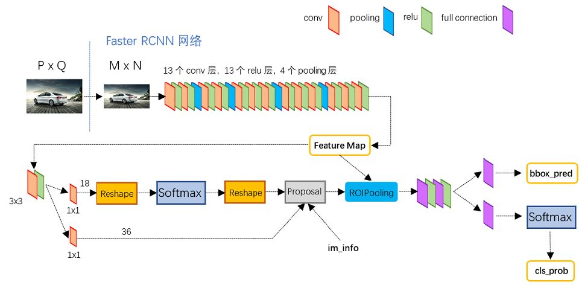

# GPA代码阅读
## fasterRCNN的整体流程

- backbone的代码是在[vgg16中定义的self.RCNN_base](../GPA-detection/lib/model/faster_rcnn/vgg16.py)中定义的
- 在[lib/model/faster_rcnn/faster_rcnn](../GPA-detection/lib/model/faster_rcnn/faster_rcnn.py)的47行由base_feat变量获得feature map

## train_baseline(只有fasterRCNN)
### main
- 首先为每种数据集设置Anchor的相关参数
- 打印训练参数
- 调用combined_roidb()方法（from [lib/roi_data_layer/roidb](#lib/roi_data_layer/roidb)），输入为第一步赋值的数据集名称
- 初始化faster RCNN的backbone
- 开始epoch循环训练（from args.start_epoch to args.max_epochs+1）
  - 设置fasterRCNN.train()
  - 根据lr_decay_step调整学习率
  - 开始step循环训练
    - 设置warm_up学习率
    - 输入im_data, im_info, gt_boxes, num_boxs开始网络的forward过程，此处网络源码提供了vgg16和resnet，下面以vgg16为例

### lib/model/faster_rcnn/vgg16
- vgg16以同文件夹下的faster_rcnn为父类，所以先读[faster_rcnn](#lib/model/fater_rcnn/faster_rcnn)
- class_agnostic控制bbox的回归方式，与之对应的是class_specific
  - agnostic的话就是不管啥类别，把bbox调整到有东西(类别非0)即可
  - specific的话，必须要调整到确定的class
  - 一般我们推荐使用class_agnostic,一模型（代码）简单，二参数数量少内存开销小运行速度快，三对结果而言没什么太大影响

### lib/roi_data_layer/roidb
- combined_roidb()
  - roidb:Region of Interest database
  - 加载图片和box
  - 调用rank_roidb_ratio，对box进行裁剪，使得宽高比(width/height)保持在ratio_large(2.0)和ratio_small(0.5)之间，返回的是剪裁后ratio的列表和对应的index

## train_GPA
### 与baseline的区别
- 参数
  - 添加参数tgt_dataset，目标域数据集
  - 添加mode，域适应的mode，默认值：gcn_adapt
  - 添加rpn_mode，域适应中rpn的mode，默认值：adapt
  - 删掉checkpoint_interval，每个多少次迭代输出一次
  - 添加da_weight，RCNN域适应loss的权重，默认值：1.0
  - 添加rpn_da_weight，RPN域适应loss的权重，默认值：1.0
  - 添加cosine_rpn_da_weight，**作用暂时未知**，action='store_true'
- 添加tgt_sampler类（与sampler同为Sampler的子类）
  - 与sampler类相似，用于采样目标域的batch数据
- 添加了目标域数据集的判断
- 添加了源域数据的val数据获取（[baseline](#train_baseline只有fasterrcnn)只有train数据的获取）
- 添加了目标域数据的train和val的数据获取，这里目标域和源域调用的都是**sampler类**，所以之前的**tgt_sampler类并没有用到**。
- 添加目标域的数据tensor holder，与源域类似
- 初始化网络，此处在实例化网络类的时候添加了mode参数和rpn_mode参数
- 开始训练：调用[fasterRCNN](#libmodeladaptive_faster_rcnnvgg16)（注:此处与baseline调用的文件不一样）的代码
  - 添加输入tgt_im_data, tgt_im_info, tgt_gt_boxes, tgt_num_boxes
  - 添加返回值
    - 与源域相对应的目标域参数tgt_rois, tgt_cls_prob, tgt_bbox_pred, tgt_rois_label
    - 在baseline的四种loss返回值之间插入了 **_(占位符)**
    - 添加RCNN_loss_intra, RCNN_loss_inter, RPN_loss_intra, RPN_loss_inter

### lib/model/adaptive_faster_rcnn/vgg16
- import不同
  - 添加model.gcn.models中的GCN
  - 添加model.gcn.utils中的get_adj
- init不同
  - 添加mode和rpn_mode属性
  - 添加lower_margin属性，**作用暂时未知**，初始值为0.5
  - 添加margin属性，**作用暂时未知**，初始值为1
- forward不同
  - 添加目标域数据的初始化
