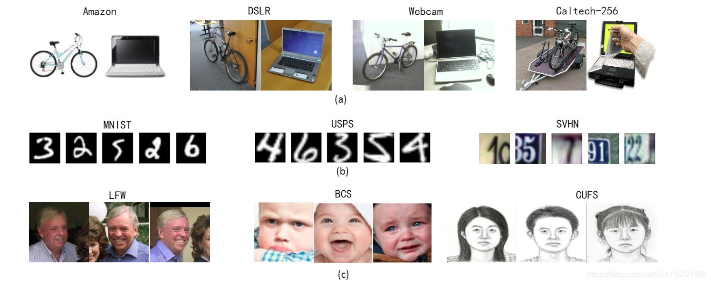
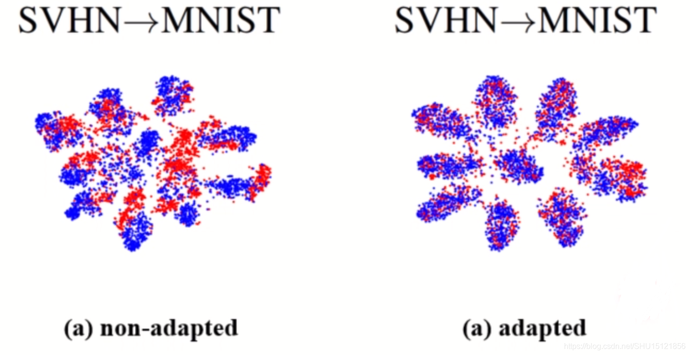
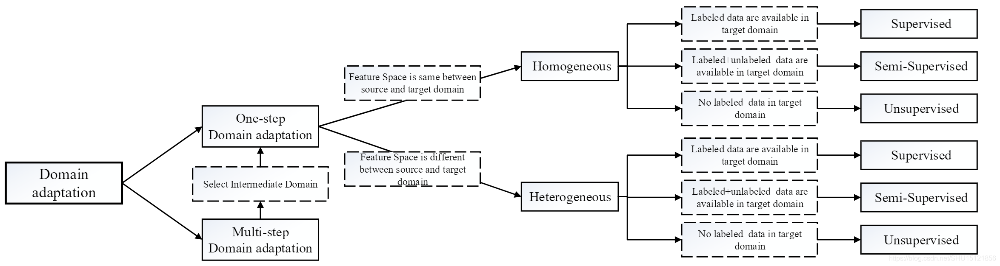

- [域自适应](#域自适应)
  - [迁移学习的直观理解](#迁移学习的直观理解)
  - [迁移学习的种类](#迁移学习的种类)
  - [领域自适应简述](#领域自适应简述)
  - [域自适应的研究方向](#域自适应的研究方向)
  - [域自适应的方法](#域自适应的方法)
- [深度学习的域适应论文调研](#深度学习的域适应论文调研)
  - [Domain Adaptive Faster R-CNN for Object Detection in the Wild](#domain-adaptive-faster-r-cnn-for-object-detection-in-the-wild)
    - [数据集](#数据集)
    - [Pipeline](#pipeline)
    - [具体方法](#具体方法)
  - [Multi-adversarial Faster-RCNN for Unrestricted Object Detection](#multi-adversarial-faster-rcnn-for-unrestricted-object-detection)
    - [数据集](#数据集-1)
    - [Pipeline](#pipeline-1)
    - [具体方法](#具体方法-1)
  - [Strong-Weak Distribution Alignment for Adaptive Object Detection](#strong-weak-distribution-alignment-for-adaptive-object-detection)
    - [数据集](#数据集-2)
    - [Pipeline](#pipeline-2)
    - [具体方法](#具体方法-2)
  - [Cross-domain Object Detection through Coarse-to-Fine Feature Adaptation](#cross-domain-object-detection-through-coarse-to-fine-feature-adaptation)
    - [数据集](#数据集-3)
    - [Pipeline](#pipeline-3)
    - [具体方法](#具体方法-3)
  - [Spatial Attention Pyramid Network for Unsupervised Domain Adaptation](#spatial-attention-pyramid-network-for-unsupervised-domain-adaptation)
    - [数据集](#数据集-4)
    - [Pipeline](#pipeline-4)
    - [具体方法](#具体方法-4)
  - [Diversify and Match: A Domain Adaptive Representation Learning Paradigm for Object Detection](#diversify-and-match-a-domain-adaptive-representation-learning-paradigm-for-object-detection)
    - [数据集](#数据集-5)
    - [Pipeline](#pipeline-5)
    - [具体方法](#具体方法-5)
- [Interesting](#interesting)
  - [Adapting Object Detectors via Selective Cross-Domain Alignment](#adapting-object-detectors-via-selective-cross-domain-alignment)
    - [数据集](#数据集-6)
    - [Pipeline](#pipeline-6)
    - [具体方法](#具体方法-6)


# 域自适应
[Blog](https://blog.csdn.net/SHU15121856/article/details/106874558)
## 迁移学习的直观理解
* 把一个领域上学习的知识迁移到另一个领域上
  * 源域(Source Domain)
  * 源任务(Source Task)
  * 目标域(Target Domain)
  * 目标任务(Target Task)

## 迁移学习的种类
* [一篇2012年的综述](https://ieeexplore.ieee.org/abstract/document/5288526/)将迁移学习按照有标记的样本的情况分为三类


## 领域自适应简述
* Domain Adaptation是一种特殊的迁移学习
  * 源任务与目标任务相同
  * 源域和目标域的数据分布不同
  * 源域有大量的标记好的样本
  * 目标域没有（或只有少数）标记的样本、
* 样例对比图

* 域自适应前后对比


## 域自适应的研究方向
* 多步域自适应（源域和目标域差距过大）
* 单步域自适应
  * 同质（Homogeneous，数据空间相同，数据分布不同）
  * 异质（Heterogeneous，数据空间都不同）
  
  同质或者异质的DA中又分别可以根据**目标域数据的打标签情况**分为**监督的、半监督的、无监督**的DA。
* 研究方向图示


## 域自适应的方法
* 基于特征的自适应（Feature Adaptation）
  * 将源域样本和目标域样本用一个映射$\Phi$调整到同一个特征空间，这样在这个特征空间样本能够“对齐”
* 基于实例的自适应（Instance Adaptation）
  * 考虑到源域中总有一些样本和目标域样本很相似，那么就将源域的所有样本的Loss在训练时都乘以一个权重$w_i$（即表示“看重”的程度），和目标域越相似的样本，这个权重就越大
* 基于模型参数的自适应（Model Adaptation）
  * 找到新的参数$\theta'$通过参数的迁移使得模型能更好的在目标域上工作

如果目标域数据没有标签，就没法用Fine-Tune把目标域数据扔进去训练，这时候无监督的自适应方法就是基于特征的自适应。因为有很多能衡量源域和目标域数据的距离的数学公式，那么就能把距离计算出来嵌入到网络中作为Loss来训练，这样就能优化让这个距离逐渐变小，最终训练出来的模型就将源域和目标域就被放在一个足够近的特征空间里了。

这些衡量源域和目标域数据距离的数学公式有KL Divergence、MMD、H-divergence和Wasserstein distance等。
# 深度学习的域适应论文调研
[Blog](https://blog.csdn.net/wangs1996/article/details/112862949?spm=1001.2014.3001.5502)
## Domain Adaptive Faster R-CNN for Object Detection in the Wild
[Paper in CVPR 2018](http://openaccess.thecvf.com/content_cvpr_2018/papers/Chen_Domain_Adaptive_Faster_CVPR_2018_paper.pdf)\
[Code](https://github.com/krumo/Domain-Adaptive-Faster-RCNN-PyTorch)\
[Blog](https://cloud.tencent.com/developer/article/1631665)
### 数据集
  * Cityscapes
  * KITTI
  * SIM10K

### Pipeline

### 具体方法
主要贡献在三个方面，可以从Loss入手理解：
$$L = L_{det} + \lambda(L_{img} + L_{ins} + L_{cst})$$
*  $L_{det}$是检测部分的损失，$L_{det} = L_{rpn} + L_{roi}$
*  $L_{img}$是Pipeline的下分支，由Image-Level的分类器产生。这个分支的输入与RPN网络的输入相同，是backbone输出的特征图。目的是学习图片级的和域无关（域不变）特征。整个分支形成一个GAN（生成对抗网络）的训练方式，backbone对于每个Domain的图片尽可能输出相同的特征，而Image-Level分类器则尽可能识别出该特征属于哪个Domain（这部分具体由 **梯度反向层(GRL,gradient revere layer)** 实现，下文详细介绍）
*  $L_{ins}$是Pipeline的上分支，由Instance—Level的分类器产生。这个分支的输入是Faster-RCNN输出的实例（bounding box），目的是学习具体目标物的域不变特征，同样通过GRL实现对抗训练。
*  $L_{cst}$是一致性正则化损失，目的是约束图片级分支和实例级分支之间的信息差异以提取域不变信息。$L_{cst} = \Sigma_{i,j}{||\frac{1}{|I|}\Sigma_{u,v}{p_i^{(u,v)}} - p_{i,j}||_2}$
*  **梯度反向层(GRL, gradient revere layer)**，其目的是在最小化Instance/Image-level domain classifier loss的同时，优化基础网络，即分类器要尽力的分类出特征属于哪一个域，同时特征抽取的基础网络需要混淆两个域的特征，从而特征对齐。
   *  梯度反传层[Paper](https://arxiv.org/abs/1409.7495) [Blog1](https://zhuanlan.zhihu.com/p/50710267) [Blog2](https://zhuanlan.zhihu.com/p/109051269)
   *  梯度反转层主要同在特征提取器与域分类器之间，那么在反向传播过程中，域分类器的域分类损失的梯度反向传播到特征提取器的参数之前会自动取反，进而实现了类似与GAN的对抗损失

## Multi-adversarial Faster-RCNN for Unrestricted Object Detection
[Paper in ICCV 2019](https://openaccess.thecvf.com/content_ICCV_2019/papers/He_Multi-Adversarial_Faster-RCNN_for_Unrestricted_Object_Detection_ICCV_2019_paper.pdf)\
[Code](https://github.com/He-Zhenwei/MAF)
### 数据集
- Cityscapes
### Pipeline


### 具体方法
只是看着比较复杂，实际上与上一篇的区别：
* 删掉了一致性正则化损失
* 在backbone的后三层分别提取了image-level的域信息
* 在GRL的后面加了一个SRM的结构。
  - SRM(比例缩小模块)，有两层卷积构成，第一层是1\*1的卷积，用于压缩特征图的channels，第二层是S\*S的卷积，用于改变特征图的size。
* 将Instance-level的GRL改成了WGRL，**实现方式与GRL的区别存疑？？？**
## Strong-Weak Distribution Alignment for Adaptive Object Detection
[Paper in CVPR 2019](https://openaccess.thecvf.com/content_CVPR_2019/papers/Saito_Strong-Weak_Distribution_Alignment_for_Adaptive_Object_Detection_CVPR_2019_paper.pdf)\
[Code](https://github.com/VisionLearningGroup/DA_Detection)\
[Blog](https://blog.csdn.net/djh123456021/article/details/88087359)
### 数据集
- PASCAL VOC 2007和2012（source）→ Clipart（target）
  - PASCAL VOC ：20个类（四个大类），2007+2012有15k张图像，常见的检测数据集
    ```
    Person: person
    Animal: bird, cat, cow, dog, horse, sheep
    Vehicle: aeroplane, bicycle, boat, bus, car, motorbike, train
    Indoor: bottle, chair, dining table, potted plant, sofa,
    tv/monitor
    ```
  - Clipart：和VOC同样的20个类，1k张图像，所有图像都用于训练和测试
- PASCAL VOC 2007和2012（source）→ WaterColor（target）
  - WaterColor：6个类（是VOC类的子集），2k图像，其中1k用于训练，1k用于测试
- Cityscapes（source）→ Foggy Cityscapes（target）
### Pipeline

### 具体方法
- 将整个特征提取器分为前后两个部分，代码中是将RCNN的前14层标记为F1，后面的层标记为F2
- 作者认为局部特征比全局特征更加重要，所以提出了强局部弱全局的方法：
  - 强局部：局部域分类器的输入是浅层特征（F1的输出），输出是与输入相同size的feature map，使用最小平方loss来训练。
  - 弱全局：全局域分类器的输入是F2的输出，该分类器使用FL损失函数（本文创新点之一），通过样本分类的难易程度（比如，一个样本是目标域的概率是0.9，那这个样本就是容易区分的样本）来降低容易分类样本的权重，增加难样本的权重（相当于忽略了一部分样本，所以成为弱全局）
  - 正则化：从局部域分类器和全局域分类器分别提取特征v1，v2，进行region-wise的拼接

## Cross-domain Object Detection through Coarse-to-Fine Feature Adaptation
[Paper in CVPR 2020](https://openaccess.thecvf.com/content_CVPR_2020/papers/Zheng_Cross-domain_Object_Detection_through_Coarse-to-Fine_Feature_Adaptation_CVPR_2020_paper.pdf)
### 数据集
- Cityscapes（source）→ Foggy Cityscapes（target）
### Pipeline

### 具体方法
- 注意力模块：在[Multi-adversarial Faster-RCNN for Unrestricted Object Detection](#multi-adversarial-faster-rcnn-for-unrestricted-object-detection)的基础上添加了注意力图(Attention Map)
- 基于原型网络的语义匹配：引入原型网络来匹配不同域的相同类别目标物
## Spatial Attention Pyramid Network for Unsupervised Domain Adaptation
[Paper in ECCV 2020](https://arxiv.org/pdf/2003.12979.pdf)
[Code](https://isrc.iscas.ac.cn/gitlab/research/domain-adaption)
### 数据集
- Cityscapes（source）→ Foggy Cityscapes（target）
### Pipeline

### 具体方法
- 将特征图用不同大小的窗口来提取均值特征，获得特征金字塔，然后用软注意力机制在不同金字塔特征之间的动态选择，来指导最终的域转换

## Diversify and Match: A Domain Adaptive Representation Learning Paradigm for Object Detection
[Paper in CVPR 2019](https://openaccess.thecvf.com/content_CVPR_2019/papers/Kim_Diversify_and_Match_A_Domain_Adaptive_Representation_Learning_Paradigm_for_CVPR_2019_paper.pdf)
### 数据集
- Cityscapes（source）→ Foggy Cityscapes（target）
### Pipeline

### 具体方法
- 利用cycle-gan在源域和目标域间生成多个中间域图像，跟源域共享一个标签，这样，可训练的数据就增多了，这些新的数据与源域和目标域一起送入faster rcnn，源域与新图像会计算检测loss，然后所有图像一起会送入域分类器，不同于通常的域适应中的域判别器，这里的分类器不是二分类，是多分类，最终的目的是希望学习到多个域之间的不变特征。

# Interesting
## Adapting Object Detectors via Selective Cross-Domain Alignment
[Paper in CVPR 2019](http://openaccess.thecvf.com/content_CVPR_2019/papers/Zhu_Adapting_Object_Detectors_via_Selective_Cross-Domain_Alignment_CVPR_2019_paper.pdf)\
[Code](https://github.com/xinge008/SCDA)
### 数据集
- Cityscapes（source）→ Foggy Cityscapes（target）
- SIM 10k （source）→ Cityscapes（target）
- KITTI（source）→ Cityscapes（target）
### Pipeline

### 具体方法
- 聚类并划分大的感兴趣区域：对RPN的输出做Grouping和reassignment操作，并且对所有候选框做重新分配，大致原理如下图：

  - 通过k-means的方法对候选框进行聚类（将a图黄色框聚类为b图的红色框，红色框的大小是固定的），为了方便计算，文中将每个红色框中的黄色框数量固定，数量不够则复制之前的框，数量超出，则选择聚类排序的前面的固定数量的框。
- 生成器：使用前面得到的红色框的特征生成图像的patch（decoder）
- 判别器：判别生成器生成的图像patch属于源域还是目标域
- 权重评估器（中间部分）：
  - 因为目标域没有ground truth，导致没办法对目标域的感兴趣区域赋予权重（目标域的红色框中没有绿色的权重数值）
  - 作者通过设置了一个判别器来为目标域的分布引入源域的的相关信息（源域的ground truth bounding box重新排序）
  - 输入$K\times m\times d$的特征，判别器$D_w$判别源域还是目标域的特征，经过sigmoid输出$K\times m$, 然后取均值得到$K$个值即$\omega_t \in \R^K$，表示$K$个regions的权重


