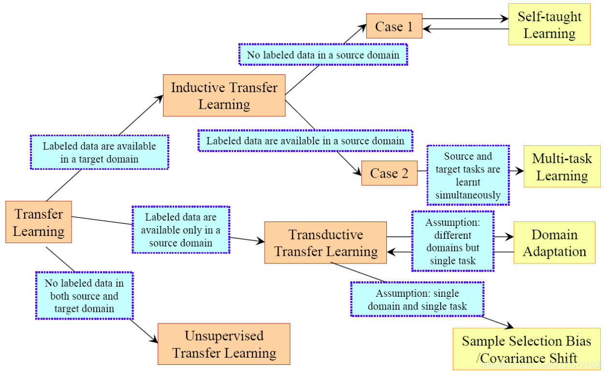

# [域自适应](https://blog.csdn.net/SHU15121856/article/details/106874558)

## 迁移学习的直观理解
* 把一个领域上学习的知识迁移到另一个领域上
  * 源域(Source Domain)
  * 源任务(Source Task)
  * 目标域(Target Domain)
  * 目标任务(Target Task)

## 迁移学习的种类
* [一篇2012年的综述](https://ieeexplore.ieee.org/abstract/document/5288526/)将迁移学习按照有标记的样本的情况分为三类

## 领域自适应简述
* Domain Adaptation是一种特殊的迁移学习
  * 源任务与目标任务相同
  * 源域和目标域的数据分布不同
  * 源域有大量的标记好的样本
  * 目标域没有（或只有少数）标记的样本、
* 样例对比图

* 域自适应前后对比

## 域自适应的研究方向
* 多步域自适应（源域和目标域差距过大）
* 单步域自适应
  * 同质（Homogeneous，数据空间相同，数据分布不同）
  * 异质（Heterogeneous，数据空间都不同）
  
  同质或者异质的DA中又分别可以根据**目标域数据的打标签情况**分为**监督的、半监督的、无监督**的DA。
* 研究方向图示

## 域自适应的方法
* 基于特征的自适应（Feature Adaptation）
  * 将源域样本和目标域样本用一个映射$\Phi$调整到同一个特征空间，这样在这个特征空间样本能够“对齐”
* 基于实例的自适应（Instance Adaptation）
  * 考虑到源域中总有一些样本和目标域样本很相似，那么就将源域的所有样本的Loss在训练时都乘以一个权重$w_i$（即表示“看重”的程度），和目标域越相似的样本，这个权重就越大
* 基于模型参数的自适应（Model Adaptation）
  * 找到新的参数$\theta'$通过参数的迁移使得模型能更好的在目标域上工作

如果目标域数据没有标签，就没法用Fine-Tune把目标域数据扔进去训练，这时候无监督的自适应方法就是基于特征的自适应。因为有很多能衡量源域和目标域数据的距离的数学公式，那么就能把距离计算出来嵌入到网络中作为Loss来训练，这样就能优化让这个距离逐渐变小，最终训练出来的模型就将源域和目标域就被放在一个足够近的特征空间里了。

这些衡量源域和目标域数据距离的数学公式有KL Divergence、MMD、H-divergence和Wasserstein distance等。
